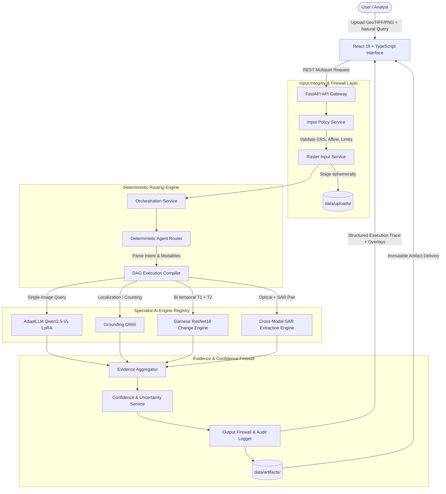

<div align="center">

# 🛰️ SatQuery AI
### **Autonomous Multi-Modal Earth Observation Vision-Language Workbench**

[](https://www.python.org/)
[](https://pytorch.org/)
[](https://fastapi.tiangolo.com/)
[](https://react.dev/)
[](https://www.typescriptlang.org/)
[](https://github.com/huggingface/peft)
[](backend/tests/)
[](LICENSE)

<p align="center">
  <b>A production-grade remote sensing intelligence system pairing domain-adapted vision foundation models with deterministic agent orchestration, strict geospatial input validation, and verifiable visual evidence.</b>
</p>

[System Overview](#-system-overview) •
[Specialist Engines](#-specialist-ai-engines) •
[Architecture](#-system-architecture) •
[Representative Queries](#-representative-query-matrix) •
[Quickstart](#-quickstart--installation) •
[API Reference](#-api-specification) •
[Evaluation & Benchmarks](#-benchmark-evaluation--provenance) •
[Documentation](#-documentation-index)

---

</div>

## 🌐 System Overview

Generic Vision-Language Models (VLMs) routinely fail on Earth Observation (EO) imagery. Overhead nadir perspectives, variable Ground Sampling Distances (GSD), multi-spectral band combinations, and radar backscatter speckle require specialized analytical architectures. Furthermore, black-box agentic frameworks often generate hallucinations without verifiable visual ground truth or calibrated confidence.

**SatQuery AI** resolves these limitations through a **Modular Specialist AI Architecture**:
1. **Deterministic Agent Routing**: Zero-hallucination state machine routing that compiles natural language queries into directed execution graphs (DAGs) without stochastic planner loops.
2. **Domain-Adapted Foundation Models**: Low-Rank Adaptation (LoRA) on remote-sensing vision-language models (`Qwen2.5-VL-3B`) fine-tuned specifically for aerial spatial reasoning.
3. **Multi-Sensor Cross-Modal Verification**: Simultaneous ingestion of optical multispectral and Synthetic Aperture Radar (SAR) imagery to penetrate cloud cover and cross-validate ground targets.
4. **Verifiable Spatial Evidence**: Explicit visual grounding with bounding boxes, pixel-level bi-temporal change difference heatmaps, and co-located SAR backscatter statistics.
5. **Defensive Engineering & Governance**: Strict input boundary validation (GeoTIFF affine matrix checks, nodata masking), ephemeral upload isolation, and non-hallucinated confidence contracts.

---

## ⚡ Specialist AI Engines

SatQuery AI executes queries across four dedicated, modular specialist engines:

```
┌────────────────────────────────────────────────────────────────────────────────────────┐
│                                SATQUERY SPECIALIST SUITE                               │
├─────────────────────┬─────────────────────┬────────────────────┬───────────────────────┤
│    VQA Specialist   │ Grounding Specialist│  Change Detection  │      Optical-SAR      │
├─────────────────────┼─────────────────────┼────────────────────┼───────────────────────┤
│ • AdaptLLM Qwen2.5- │ • Grounding DINO    │ • Siamese ResNet18 │ • Co-located Spatial  │
│   VL-3B (LoRA)      │   Zero-Shot BBoxes  │   Feature Diff     │   Backscatter Intersect│
│ • Scene reasoning   │ • Text-prompted NMS │ • Deep cosine & L2 │ • SAR intensity stats │
│ • Land-cover class  │ • Deduplication     │   distance metric  │   (mean, variance, dB)│
│ • Spatial relations │ • Spatial counting  │ • Binary change map│ • All-weather optical │
│ • Qualitative conf. │   audit evidence    │ • Bi-temporal VQA  │   cloud penetration   │
└─────────────────────┴─────────────────────┴────────────────────┴───────────────────────┘
```

### 1. Visual Question Answering (VQA) Engine
- **Base Architecture**: `AdaptLLM/remote-sensing-Qwen2.5-VL-3B-Instruct`
- **Adaptation Methodology**: Parameter-Efficient Fine-Tuning (PEFT) with LoRA rank $r=8$, scaling $\alpha=16$, dropout $p=0.05$ targeting attention projection layers (`q_proj`, `k_proj`, `v_proj`, `o_proj`, `gate_proj`, `up_proj`, `down_proj`).
- **Supervision**: Assistant-token loss supervision with isolated scene-grouped data to prevent cross-split spatial leakage.
- **Weights Location**: `training/checkpoints/satquery_vqa_lora_corrected/`

### 2. Zero-Shot Grounding & Counting Engine
- **Base Architecture**: `Grounding DINO` (Swin-T backbone with cross-modal multi-scale text-image attention)
- **Localization Guardrails**: Bounding box coordinate clipping to image bounds $[0, 1]$, confidence threshold filtering ($\tau \ge 0.35$), and Non-Maximum Suppression (NMS) with IoU threshold $\theta = 0.5$.
- **Verifiable Counting**: Direct enumeration of validated spatial detections rather than stochastic language-model token generation.

### 3. Bi-Temporal Change Detection Engine
- **Base Architecture**: Deep Siamese Feature Distance Network (ResNet-18 encoder)
- **Algorithm**: Extracts multi-scale deep spatial activations from registered temporal rasters ($T_1$ and $T_2$), computing normalized Euclidean feature differences.
- **Outputs**: High-resolution continuous change heatmaps, Otsu/adaptive-thresholded binary masks, connected component bounding boxes, and temporal transition summaries.

### 4. Optical–SAR Cross-Modal Synthesis Engine
- **Cross-Modal Spatial Join**: Links optical candidate bounding boxes to co-located radar coordinates on registered Sentinel-1 / Sentinel-2 imagery.
- **Statistical Extraction**: Computes localized SAR backscatter distribution metrics ($\mu$, $\sigma^2$, skewness) and Pearson intensity correlation between optical reflectance and SAR backscatter.
- **Cloud-Penetrating Verification**: Resolves ambiguity in cloud-obscured or low-contrast optical zones using active microwave penetration.

---

## 🏗️ System Architecture

The SatQuery AI pipeline enforces deterministic execution from ingestion to presentation:



### Deterministic Plan Execution Sequences

1. **Bi-Temporal Inspection Workflow**:
   $$\text{Input}(T_1, T_2, \text{Query}) \xrightarrow{} \text{Change Detection}(\Delta) \xrightarrow{} \text{Grounding}(\text{Change Targets}) \xrightarrow{} \text{Paired VQA}(T_1, T_2, \text{BBoxes})$$
2. **Optical–SAR Cross-Modal Workflow**:
   $$\text{Input}(\text{Opt}, \text{SAR}, \text{Query}) \xrightarrow{} \text{Optical Grounding} \xrightarrow{} \text{Co-located SAR Stats}(\mu, \sigma) \xrightarrow{} \text{Dual-Sensor VQA}$$

---

## 📊 Representative Query Matrix

SatQuery AI supports the operational scenarios defined in Earth Observation benchmarks and hackathon challenges:

| # | Representative Natural Query | Modalities | Dispatched Execution DAG | Generated Verifiable Evidence |
|---|---|---|---|---|
| **1** | *"Describe the land-cover and major objects visible in this image."* | Single Optical | `VQA` | Land-cover classification, object inventory, scene description. |
| **2** | *"Highlight and count the water bodies and storage tanks."* | Single Optical | `GROUNDING` $\rightarrow$ `VQA` | Geo-referenced bounding boxes, detector scores, audited object count. |
| **3** | *"What changed between these two dates, and where did it occur?"* | Bi-Temporal ($T_1, T_2$) | `CHANGE_DETECTION` $\rightarrow$ `GROUNDING` $\rightarrow$ `VQA` | Spatial change heatmap, binary change mask, target bounding boxes, temporal narrative. |
| **4** | *"Has the built-up area increased, decreased, or remained unchanged?"* | Bi-Temporal ($T_1, T_2$) | `CHANGE_DETECTION` $\rightarrow$ `VQA` | Directional change confirmation (`increased`, `decreased`, or `unchanged`), change magnitude. |
| **5** | *"Use optical and SAR images together to identify built-up and water regions."* | Optical + SAR | `OPTICAL_SAR` $\rightarrow$ `GROUNDING` $\rightarrow$ `VQA` | Multi-spectral candidate boxes, co-located SAR backscatter dB profile, cross-sensor synthesis. |

---

## 🚀 Quickstart & Installation

### Hardware & Environment Requirements
- **Operating System**: Windows 10/11, Ubuntu 22.04+, or macOS
- **Python**: 3.10 – 3.12 (Validated on Python 3.12.10)
- **Node.js**: v18.0.0 or higher with npm
- **VRAM (Optional)**: 8 GB+ NVIDIA GPU with CUDA 12.x recommended for neural inference; CPU offload fallback supported.

---

### Option A: Automated One-Click Launch (Windows)

Launch the entire stack (FastAPI backend + Vite React 19 frontend) with persistent process tracking:

```powershell
# From the repository root
./start-local.ps1
```

- **Frontend Interface**: [http://127.0.0.1:5173](http://127.0.0.1:5173)
- **API Documentation**: [http://127.0.0.1:8000/docs](http://127.0.0.1:8000/docs)
- **Runtime Server Logs**: Stored under `scratch/server-logs/`

To cleanly terminate all running background instances:
```powershell
Get-Process python, node -ErrorAction SilentlyContinue | Where-Object { $_.MainWindowTitle -match "uvicorn" -or $_.CommandLine -match "satquery" } | Stop-Process
```

---

### Option B: Manual Production Setup

#### 1. Backend Service Setup
```bash
# Clone the repository
git clone https://github.com/bhuvaneshwarann-ma/SatQuery-AI.git
cd SatQuery-AI

# Create virtual environment
python -m venv .venv
# On Windows:
.venv\Scripts\Activate.ps1
# On Linux/macOS:
source .venv/bin/activate

# Install locked dependencies
pip install -r requirements.txt

# Start FastAPI backend service
python -m uvicorn backend.app.main:app --host 127.0.0.1 --port 8000 --workers 1
```

#### 2. Frontend Application Setup
```bash
# In a separate terminal, navigate to the frontend directory
cd frontend

# Install package dependencies
npm ci

# Start the Vite development server
npm run dev -- --host 127.0.0.1 --port 5173
```

---

## 🧪 Testing & Validation

SatQuery AI includes a rigorous testing pyramid covering unit tests, geospatial raster decoding, deterministic agent routing, and end-to-end integration:

```bash
# Run complete backend test suite (40+ unit & integration tests)
.venv\Scripts\python.exe -m unittest discover -s backend/tests -p "test_*.py"

# Execute official SIH Release and Defensibility Audit
.venv\Scripts\python.exe scripts/sih_release_check.py

# Verify frontend TypeScript compilation and code health
cd frontend
npm run build
npm run lint
```

### Full Heavy-Model Testing
To validate real neural model loading, VRAM allocation, and end-to-end GPU inference:
```powershell
$env:SATQUERY_MODEL_TESTS="1"
.venv\Scripts\python.exe -m unittest backend.tests.test_end_to_end
```

---

## 🎯 Model Adaptation & Training

The repository provides full reproducibility scripts to train and evaluate the domain-adapted remote-sensing VQA LoRA adapter:

```
training/
├── configs/
│   ├── vqa_lora.yaml             # LoRA hyperparameters, optimizer rates, rank configuration
│   └── bigearthnet_txt.yaml      # Multi-sensor BigEarthNet.txt training specification
├── data/
│   ├── prepare_vqa.py            # Dataset normalization and task classification
│   ├── prepare_bigearthnet_txt.py# Sentinel-1/Sentinel-2 paired data manifest builder
│   ├── validate_vqa.py           # Cross-split non-leakage verification gate
│   ├── vqa_train.json            # Scene-isolated training split
│   └── vqa_val.json              # Scene-isolated validation split
├── checkpoints/
│   └── satquery_vqa_lora_corrected/ # Standalone PEFT adapter weights (.safetensors)
├── train_vqa_lora.py             # PyTorch + PEFT training script with memory offload
└── evaluate_vqa.py               # Controlled side-by-side benchmark evaluation runner
```

### Execute Fine-Tuning Pipeline
```bash
# Step 1: Preprocess and validate non-leaking data splits
python training/data/prepare_vqa.py
python training/data/validate_vqa.py

# Step 2: Train the LoRA adapter
python training/train_vqa_lora.py

# Step 3: Run controlled comparative benchmark scoring
python training/evaluate_vqa.py
```

---

## 📡 API Specification

The FastAPI backend exposes standard RESTful endpoints accepting `multipart/form-data` uploads:

### `POST /api/analyze`
Executes multi-modal query routing and specialist analysis.

#### Request Parameters (Multipart Form)
| Parameter | Type | Required | Description |
| :--- | :--- | :---: | :--- |
| `query` | `string` | **Yes** | Natural language analysis prompt (Max 4,000 chars). |
| `file` | `binary` | **Yes** | Primary satellite image (GeoTIFF, PNG, JPEG, max 20 MiB). |
| `second_file` | `binary` | No | Secondary image ($T_2$ for temporal change, or SAR for optical-SAR). |
| `modality` | `string` | No | Sensor modality hint (`optical`, `multispectral`, `sar`). |

#### Example cURL Request
```bash
curl -X POST "http://127.0.0.1:8000/api/analyze" \
  -F "query=What changes occurred between these two observations?" \
  -F "file=@data/samples/sample_satellite_port.jpg" \
  -F "second_file=@data/samples/sample_satellite_port_t2_synthetic.jpg"
```

#### Structured Response Schema
```json
{
  "task_id": "sat_task_9c2f1a8e",
  "status": "completed",
  "query": "What changes occurred between these two observations?",
  "routed_task": "CHANGE_DETECTION",
  "execution_plan": ["CHANGE_DETECTION", "GROUNDING", "VQA"],
  "result": {
    "answer": "Identified significant new construction and dock alterations along the western coastline.",
    "confidence": {
      "status": "DETECTOR_SCORED",
      "score": 0.84,
      "details": "Empirical detector score from Grounding DINO on change regions."
    },
    "evidence": {
      "bounding_boxes": [
        {"label": "new structure", "box_2d": [124, 210, 310, 415], "score": 0.84}
      ],
      "change_detection": {
        "heatmap_artifact": "data/artifacts/change_heatmap_9c2f1a8e.png",
        "mask_artifact": "data/artifacts/change_mask_9c2f1a8e.png",
        "changed_pixels_percentage": 6.42
      }
    },
    "execution_trace": [
      {"stage": "input_validation", "duration_ms": 12, "status": "PASSED"},
      {"stage": "change_detection", "duration_ms": 310, "status": "PASSED"},
      {"stage": "grounding", "duration_ms": 480, "status": "PASSED"},
      {"stage": "vqa_synthesis", "duration_ms": 1150, "status": "PASSED"}
    ]
  }
}
```

---

## 📈 Benchmark Evaluation & Provenance

SatQuery AI provides native manifest templates and automated scoring runners for established remote sensing benchmarks:

| Benchmark | Task Focus | Primary Metrics | Provenance & Source |
| :--- | :--- | :--- | :--- |
| **BigEarthNet.txt** | Multi-sensor (S1/S2) VQA & Grounding | Token-F1, Exact Match | [BIFOLD BigEarthNet](https://huggingface.co/datasets/BIFOLD-BigEarthNetv2-0/BigEarthNet.txt) (CDLA-Permissive-1.0) |
| **RSVQA-LR** | Low-resolution single-image VQA | Accuracy, Token-F1 | [RSVQA-LR-2k](https://huggingface.co/datasets/dmarsili/RSVQA-LR-2k) (CC-BY-4.0) |
| **CDVQA** | Bi-temporal change description & direction | Token-F1, Directional Accuracy | [CDVQA Benchmark](https://github.com/YZHJessica/CDVQA) |
| **VRSBench** | Captioning, Grounding & Object VQA | IoU@0.5, Recall@0.5 | [VRSBench](https://github.com/lx709/VRSBench) |
| **SEN1-2** | Registered Sentinel-1 SAR & Sentinel-2 Optical | Pearson correlation, IoU | Open Copernicus Sentinel-1/2 Archives |

Execute standardized evaluation on registered benchmark manifests:
```bash
python scripts/run_prescribed_evaluations.py --dataset rsvqa_lr --manifest data/benchmarks/rsvqa_lr/manifest.json
```

---

## 🛡️ Defensive Guardrails & Security

- **Strict Payload Limits**: Request bodies are capped at 61 MiB; individual images are bounded to 20 MiB and 4,000,000 pixels to prevent memory exhaustion attacks.
- **Ephemeral Storage Lifecycle**: User uploads staged in `data/uploads/` are guaranteed to be unlinked upon request completion. Generated visualization artifacts are immutably persisted in `data/artifacts/`.
- **Maintenance Retention**: Automated dry-run and scheduled artifact cleanup:
  ```bash
  # Check expired artifacts older than 30 days
  python -m backend.maintenance --older-than-days 30
  # Apply deletion
  python -m backend.maintenance --older-than-days 30 --apply
  ```
- **Concurrency & Queue Throttling**: Ingestion throttles parallel requests to max 4 concurrent tasks with single-worker GPU inference serialization to prevent Out-Of-Memory (OOM) crashes.

---

## 📂 Project Directory Structure

```text
SatQuery-AI/
├── ai/
│   ├── evaluation/            # Prescribed benchmark runners and metrics
│   └── inference/             # Model inference engines (VQA, Grounding, Change, Optical-SAR)
├── backend/
│   ├── app/
│   │   ├── agent/             # Deterministic router, tool registry, and execution contracts
│   │   ├── api/               # FastAPI route controllers and Pydantic schemas
│   │   └── services/          # Orchestration, raster decoding, confidence, and artifact services
│   └── tests/                 # Unit, integration, and end-to-end test suites
├── data/
│   ├── artifacts/             # Persistent immutable output products (heatmaps, bboxes)
│   ├── benchmarks/            # Benchmark datasets and evaluation manifests
│   ├── samples/               # Bundled sample satellite rasters for instant demos
│   └── uploads/               # Ephemeral temporary upload staging directory
├── docs/                      # Comprehensive technical documentation & audits
├── frontend/
│   ├── src/                   # React 19 + TypeScript source code
│   │   ├── api/               # API clients and types
│   │   ├── components/        # Interactive canvas, stage indicators, result views
│   │   └── pages/             # Analysis, Evaluation, History, and Model inspection pages
│   └── package.json           # Frontend dependency manifest
├── results/                   # Measured benchmark evaluation outputs (.json & .md)
├── scripts/                   # Demo scripts, benchmark preparers, and release checkers
├── training/                  # PEFT LoRA training configs, scripts, and checkpoints
├── README.md                  # This file
├── requirements.txt           # Python dependency specifications
├── requirements-lock.txt      # Exact locked Python package versions
└── start-local.ps1            # Windows automated one-click startup script
```

---

## 📚 Documentation Index

Detailed engineering guides and architectural records are available in the [`docs/`](docs/) directory:

- [System Architecture Specification](docs/architecture.md) — Comprehensive technical architecture, pipeline contracts, and design principles
- [API Reference Manual](docs/api.md) — Complete endpoint documentation, request/response models, and error codes
- [Production Deployment Guide](docs/deployment.md) — Reverse-proxy configuration, systemd services, and resource boundaries
- [Verification & Testing Runbook](docs/testing.md) — Test execution guidelines, mock fixtures, and validation checklists
- [Model Training & LoRA Guide](docs/training.md) — Deep-dive on PEFT training, hyperparameter selection, and memory offload
- [SIH Requirements Compliance Audit](docs/SIH_REQUIREMENTS_AUDIT_2026-09-27.md) — Line-by-line compliance audit against hackathon problem statements
- [Dataset Provenance & Licenses](docs/dataset_provenance.json) — Official benchmark sources, licenses, and data split policies

---

## 📜 Citation

If you utilize SatQuery AI or its adapter checkpoints in your research or application, please cite:

```bibtex
@software{satquery_ai_2026,
  author       = {Bhuvaneshwaran N},
  title        = {SatQuery AI: Autonomous Multi-Modal Earth Observation Vision-Language Workbench},
  year         = {2026},
  publisher    = {GitHub},
  journal      = {GitHub repository},
  howpublished = {\url{https://github.com/bhuvaneshwarann-ma/SatQuery-AI}}
}
```

---

## 📄 License

Distributed under the Apache 2.0 License. See [`LICENSE`](LICENSE) for complete license text.
